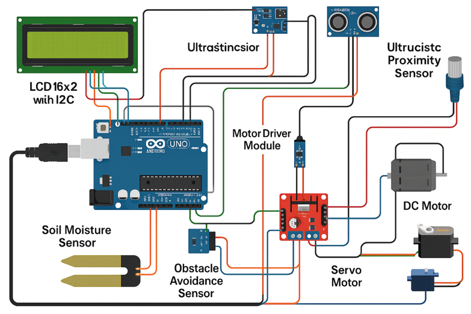
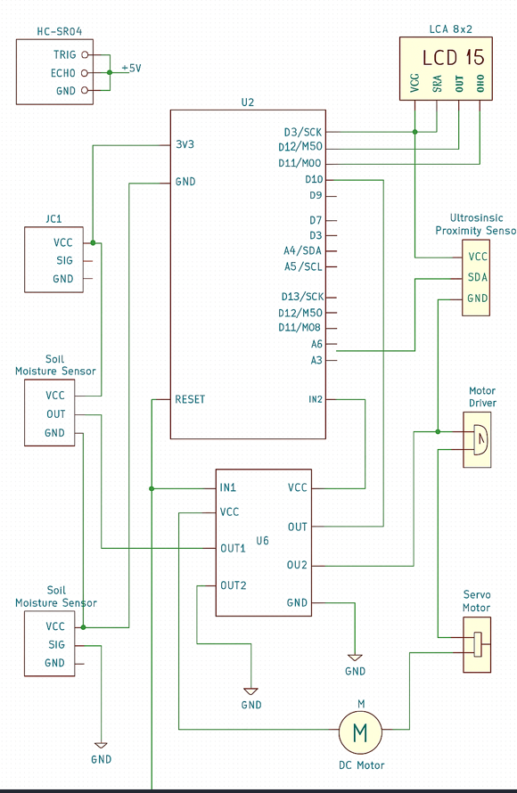

#  Smart Waste Management

|`Author` | Olaru Livia

## Description

The "Smart Waste Management" focuses on creating an automated system for waste segregation to promote efficient recycling and waste management. The setup features a conveyor belt mechanism powered by an Arduino microcontroller, designed to sort garbage into distinct categories. As shown in the image, the system includes two labeled bins—one for "Metal" and another for "Plastic"—indicating that the machine likely uses sensors (e.g., inductive or capacitive sensors) to detect and classify materials based on their properties. A mechanical arm or flap directs the sorted items into the appropriate bins. This project aims to streamline waste sorting, reduce manual labor, and contribute to sustainable waste management by ensuring recyclable materials are properly separated. 

## Motivation

The motivation for this project likely stems from the growing global concern over waste management and the need for sustainable solutions. The increasing volume of garbage, coupled with inefficient sorting practices, contributes to environmental pollution and resource depletion. By developing a "Smart Waste Management," the project seeks to address these issues by automating the segregation of recyclable materials like metal and plastic, reducing human error and effort. The use of an accessible platform like Arduino suggests a goal of creating an affordable, scalable solution that can be adopted in households, schools, or small communities. Additionally, the project may be driven by a desire to raise awareness about recycling, promote eco-friendly habits, and provide a practical learning experience using electronics and programming.

## Architecture
The architecture of your "Smart Garbage Sorting Machine using Arduino" is a well-integrated system designed for automated waste segregation, leveraging a variety of components for functionality. At its core, an Arduino microcontroller (l supported by the Development Board Compatible with Arduino UNO R3) serves as the central processing unit, coordinating sensor inputs and actuator outputs. The system is powered by a 9V battery support, ensuring portability.

The conveyor mechanism, driven by a Gearmotor with Wheel, transports waste items across the sorting area. Material detection is handled by multiple sensors: an SN04-N Inductive Proximity Sensor for metal detection, an Infrared Obstacle Sensor for general object presence, and an HC-SR04 Ultrasonic Sensor for distance measurement, which may assist in positioning or object size assessment. The L298N Dual Motor Driver controls the conveyor and possibly a sorting actuator, such as a servo or flap, enabling precise movement to direct items into designated bins.A Ground Humidity Sensor Module might be included to detect moisture levels, potentially aiding in sorting organic waste or ensuring dry recyclables. The SG90 180° servo could control the sorting mechanism, tilting or pushing items based on sensor data. For user feedback, a 1602 LCD with I2C interface and yellow-green backlight displays system status. 

The system is assembled on a Breadboard HQ (830 points) with Breadboard Jumper Wires Sets and 10 cm/20 cm Male-Female Wires for connectivity. This modular architecture, combining sensors, actuators, and a user interface, ensures efficient sorting of metal and plastic waste.

### Block diagram

<!-- Make sure the path to the picture is correct -->

### Schematic

### Components

| Device | Usage | Price |
|--------|--------|-------|
| Activ Buzzer | Buzzer | [1.5 RON](https://www.optimusdigital.ro/ro/audio-buzzere/635-buzzer-activ-de-3-v.html?search_query=buzzer&results=61) |
| Push Button | Button | [1 RON](https://www.optimusdigital.ro/ro/butoane-i-comutatoare/1119-buton-6x6x6.html?search_query=buton&results=222) |
| HC-SR04 Ultrasonic Sensor | Sensor | [6.49 RON](https://www.optimusdigital.ro/ro/senzori-senzori-ultrasonici/9-senzor-ultrasonic-hc-sr04-.html?srsltid=AfmBOootBPrUATlwLf4HeFH1YIeahjJyGr4TGfCvfdEBiaD-u3K2tDvX) |
| L298N Dual Motor Driver | Motor | [10.99 RON](https://www.optimusdigital.ro/en/brushed-motor-drivers/145-l298n-dual-motor-driver.html?srsltid=AfmBOoqwFgqYLe84tv8JPwx6YgXOAKAlEkKPCjQdB1hPojCcXELARgGb) |
| Jumper Wires | Connecting components | [7 RON](https://www.optimusdigital.ro/ro/fire-fire-mufate/884-set-fire-tata-tata-40p-10-cm.html?search_query=set+fire&results=110) |
| Breadboard | Project board | [10 RON](https://www.optimusdigital.ro/ro/prototipare-breadboard-uri/8-breadboard-830-points.html?search_query=breadboard&results=145) |
| SN04-N Inductive Proximity Sensor | Sensor | [14.99 RON](https://www.optimusdigital.ro/en/distance-sensors/8184-sn04-n-inductive-proximity-sensor.html?srsltid=AfmBOooejlVhL7s9Vi1X7dW2hJJdSA7u-HKxUFmRYQy3J-wKV2hKZWPz) |
|  1602 LCD with I2C Interface and Yellow-Green Backlight| Display | [14.99 RON](https://www.optimusdigital.ro/en/lcds/62-1602-lcd-with-i2c-interface-and-yellow-green-backlight.html?srsltid=AfmBOopKAZIufweGjhokxFL0AXa6k3RrFd3zKV7rbfG8a5CgpLMtb1j5) |
| Development Board Compatible with Arduino UNO R3 (ATmega328p + ATmega16u2) + 50 cm Cable | Connection | [54.37 RON](https://www.optimusdigital.ro/en/avr-boards/4561-development-board-compatible-with-arduino-uno-r3-atmega328p-atmega16u2-50-cm-cable.html?srsltid=AfmBOooboVulUufX3IPWz_unFjWUzWObENSPxptNosI_wOPummSdngfG) |
|Gearmotor with wheel| Motor | [29.98 RON](https://www.optimusdigital.ro/en/37-mm-gearmotors/2919-jgb37-520-gearmotor-with-encoder-and-wheel-12-v-320-rpm.html?srsltid=AfmBOooj4CuLYjyp7-xFiK3diAr4TLdtTHiSDnHkCn5fYxAp4eZxrWrf) |

### Libraries

<!-- This is just an example, fill in the table with your actual components -->

| Library | Description | Usage |
|---------|-------------|-------|
| [Ucglib](https://github.com/olikraus/ucglib) | Color graphics library for embedded systems with focus on Arduino Environment | Used for the LCD Display  |

## Log

[Article 1](https://www.explainthatstuff.com/induction-motors.html)

[Link title](https://projecthub.arduino.cc/)
[Link title](https://projecthub.arduino.cc/)
